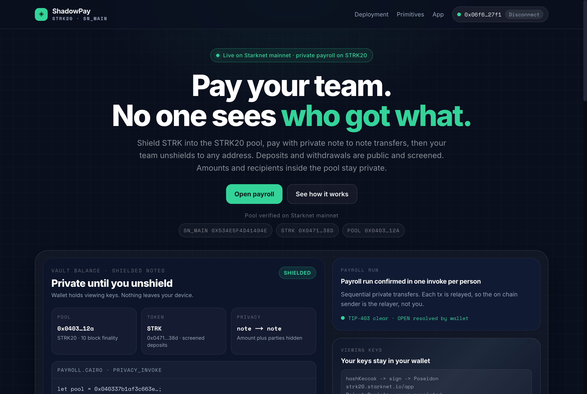

# ShadowPay · Private payroll on Starknet

<p align="center">
  
</p>

[](https://shadowpay-green.vercel.app)
[](https://shadowpay-green.vercel.app/demo.mp4)
[](https://starkscan.co/contract/0x040337b1af3c663e86e333bab5a4b28da8d4652a15a69beee2b677776ffe812a)
[](https://github.com/starkience/strk20-hackathon)
[](./LICENSE)
[](#stack)

**Pay your team on Starknet. No one sees who got what.**

Every Starknet payroll is public. ShadowPay fixes it: shield STRK into the STRK20 privacy pool, pay your team with unlinkable note→note transfers, and let them unshield on demand.

Built for the [STRK20 Private Sprint](https://github.com/starkience/strk20-hackathon). Registration PR: [#140](https://github.com/starkience/strk20-hackathon/pull/140).

**[Live demo](https://shadowpay-green.vercel.app)** · **[Demo video](https://shadowpay-green.vercel.app/demo.mp4)** · **[Proof](#proof--five-mainnet-pool-transactions)** · **[How it works](#how-it-works)**

## Proof · five mainnet pool transactions

Every hash below is a real SN_MAIN call against the STRK20 pool, executed from this app with the Ready X wallet. Gas paid in STRK, receipts decoded with `scripts/inspect-tx.mjs`.

| # | Action | What it proves | Gas | Tx |
|---|---|---|---|---|
| 1 | Enable private tokens + shield 7 STRK | wallet constructor + public deposit into the pool | 3.25 STRK | [`0x4065…0b7`](https://starkscan.co/tx/0x4065345b1084f0f15b8b9bb3062800369bc7da82d8df9c37b3d8f2253a060b7) |
| 2 | Shield 18 STRK | funds the shielded balance that pays private-op fees | 2.66 STRK | [`0x6c3c…25a`](https://starkscan.co/tx/0x6c3c433367cdb1642161ec6174c72ff85b359f78641972842d4ec8ab23d525a) |
| 3 | Private transfer 1 STRK | note→note: amount and parties hidden by the STARK proof, relayer is the on-chain sender | 2.87 STRK | [`0xcd07…c99`](https://starkscan.co/tx/0xcd077435fa89736af54844109f66243ffa6bc4406a0946266358ee6fde1c99) |
| 4 | Unshield 0.5 STRK | public withdrawal to a fresh address, private history stays hidden | 2.93 STRK | [`0x6156…150`](https://starkscan.co/tx/0x6156cc8680b7a9ab428c35607636d2a1e9bd60ec3b038fc61b40498e4f05150) |
| 5 | Shield 7 STRK, on camera | executed live during the demo recording | 2.83 STRK | [`0x3010…1db`](https://starkscan.co/tx/0x3010f4a3002b87277a58ea307501c8907917052ce09749594cbb36db94d11db) |

Same list machine-readable in [`strk20.json`](./strk20.json).

### Contracts (SN_MAIN)

| Contract | Address |
|---|---|
| STRK20 pool | [`0x040337b1af3c663e86e333bab5a4b28da8d4652a15a69beee2b677776ffe812a`](https://starkscan.co/contract/0x040337b1af3c663e86e333bab5a4b28da8d4652a15a69beee2b677776ffe812a) |
| STRK token | [`0x04718f5a0fc34cc1af16a1cdee98ffb20c31f5cd61d6ab07201858f4287c938d`](https://starkscan.co/contract/0x04718f5a0fc34cc1af16a1cdee98ffb20c31f5cd61d6ab07201858f4287c938d) |
| Echo helper (3-action bundle) | [`0x78ae662e0cc6d1ab2cfeaf2a51ba8783d88e31886f88a794d142f95a6f8735b`](https://starkscan.co/contract/0x78ae662e0cc6d1ab2cfeaf2a51ba8783d88e31886f88a794d142f95a6f8735b) · class `0x2a4482a13cb7f70dce6f7ba99c4ee6ce404379abeddd9b831b6bf24eb71e137` |

## What is private, what is not

Honest accounting: overclaiming costs credibility.

| Private (inside the pool) | Public by design |
|---|---|
| Who paid whom in `note→note` transfers | `deposit` (shield) and `withdraw` (unshield): screened by the compliance signer, amount + token visible |
| Amount of each private transfer | DeFi via shared anonymizers (Ekubo, Vesu, Echo): pool address visible, amounts and timing visible |
| Link between your shielded notes | On-chain sender for private txs is the **relayer**, not you; eligibility is the `Deposit` event's `user_addr` |

Deposits and withdrawals stay public and screened. Privacy lives in the `note→note` step and is strictly stronger the longer you stay shielded.

## How it works

```
Org:  Connect → Shield 5000 STRK (public deposit) ─┐
                  │ 10-block finality               │
      Private note→note to team[0] 1200  ───────────┼─→ pool 0x0403…12a (SN_MAIN)
      Private note→note to team[1]  900             │   proofs verified on-chain
      Private note→note to team[2] 1500  ───────────┘

Employee: Connect → discoverNotes → "you were paid privately" → unshield to any Starknet address
```

Wallet holds viewing keys and proves. No hosted prover. Placeholders `"OPEN"`, `"${poolAddress}"`, `"${openNoteIds[0]}"` are substituted by the wallet, never hex-normalized.

## The app

<p align="center">
  
</p>

Connect a STRK20 wallet, set the amount, then shield, transfer privately, or unshield. Amounts are user-entered (1 STRK default) so you never spend more than you intend. A friendly `NOT_REGISTERED` guide walks fresh wallets through enabling private tokens. AutoReconnect resumes silently after reloads.

## Stack

Next.js 16 · React 19 · TypeScript · starknet.js 10 · `WalletAccountV6` + `strk20InvokeTransaction` · zustand · `get-starknet` v6 discovery. Default `ContractDiscoveryProvider(poolContract)`, no indexer.

## Run locally

```bash
npm install
cp .env.example .env.local   # add your Alchemy Starknet RPC key
npm run dev                  # http://localhost:3000
```

`.env.local` (see `.env.example`):

```
NEXT_PUBLIC_PROVIDER_URL=your-alchemy-key        # Starknet RPC (falls back to Lava public RPC if omitted)
NEXT_PUBLIC_STRK20_ECHO_HELPER_SEPOLIA=0x0        # echo helper on Sepolia, or leave 0x0 to disable Echo
```

Primary wallet: **Ready** (the picker is generic EIP-6963, any announced Starknet wallet appears).

### The 3-tx submission flow (mainnet)

1. **Shield**: public `deposit` 2–3 STRK → capture `tx1` (wait 10 blocks)
2. **Private transfer**: `note→note` 1 STRK to self or teammate → `tx2` (relayed, wait 10 blocks)
3. **Unshield / Echo `privacy_invoke`**: withdraw 1 STRK or invoke echo helper `0x78ae…35b` → `tx3`

Each hash goes in `strk20.json` at the repo root. The hub verifies: exists + succeeded + touched the pool.

## Deploy

This deployment: [shadowpay-green.vercel.app](https://shadowpay-green.vercel.app) (Vercel prod). To deploy your own: `vercel --prod` with `NEXT_PUBLIC_PROVIDER_URL` set in the Vercel env.

## Project structure

```
src/app/page.tsx                          # vault landing + app panel (WalletAccountV6Tag)
src/app/components/client/WalletHandle/   # SelectWallet + shield/transfer/unshield/echo
src/utils/constants.ts                    # pool, token, providers, echo helper
cairo/src/lib.cairo                       # echo anonymizer (deploy your own for Sepolia)
scripts/                                  # e2e + qa harnesses, tx decoder, demo take/mux pipeline
```

## Links

STRK20 by example · [Privacy SDK](https://github.com/starkware-libs/starknet-privacy) · [WalletAccount guide](https://starknet-js.com/docs/next/guides/account/walletAccount/#with-get-starknet-v6) · Pool on [Voyager](https://voyager.online/contract/0x040337b1af3c663e86e333bab5a4b28da8d4652a15a69beee2b677776ffe812a)

## License

MIT · see [LICENSE](./LICENSE). Bootstrapped from [PhilippeR26/Starknet-WalletAccount](https://github.com/PhilippeR26/Starknet-WalletAccount) and the [STRK20 starter kit](https://github.com/Akashneelesh/strk20-starter-kit).
